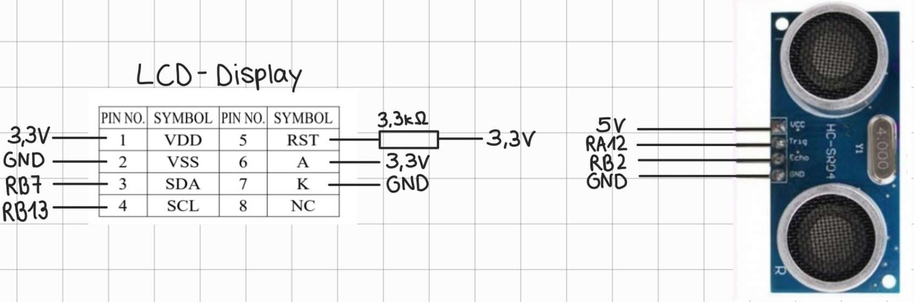
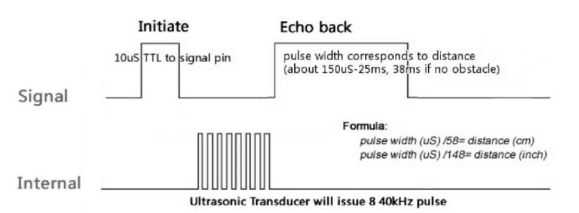
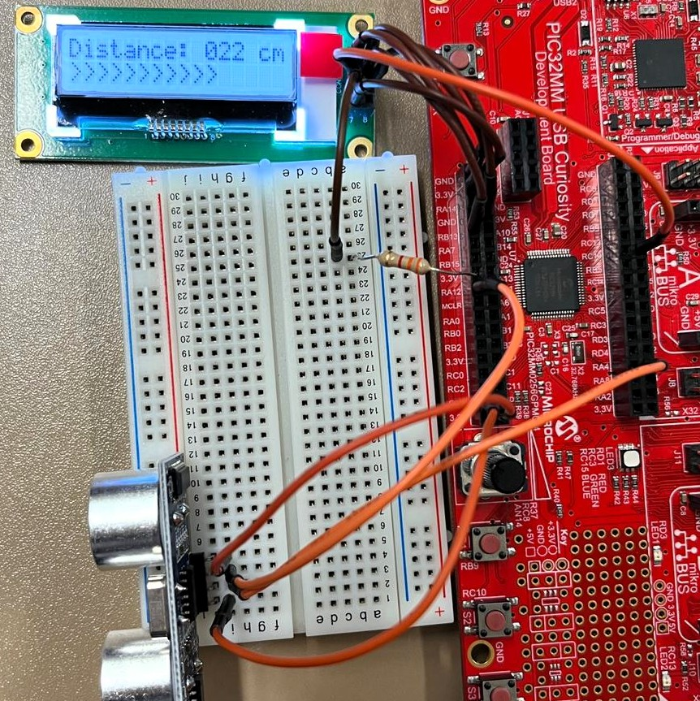
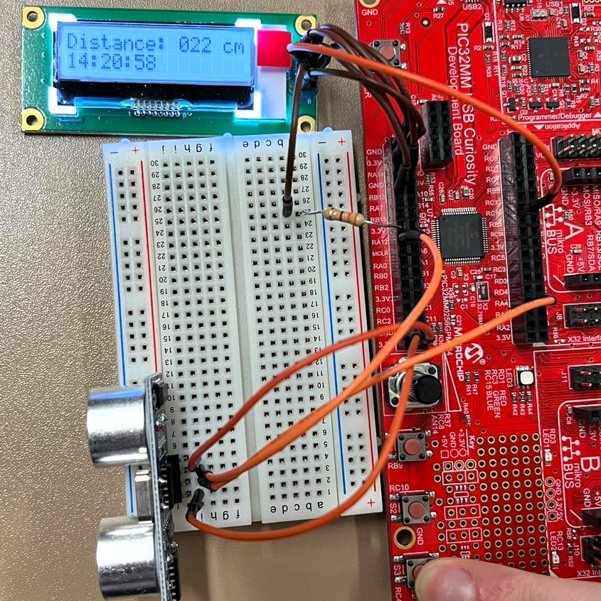
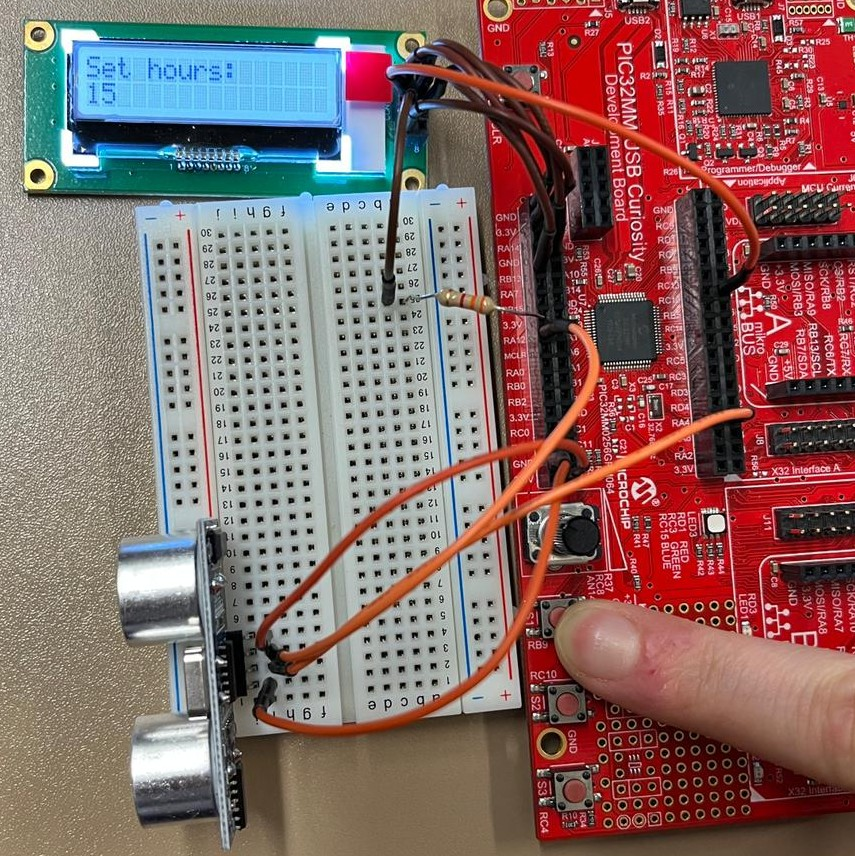
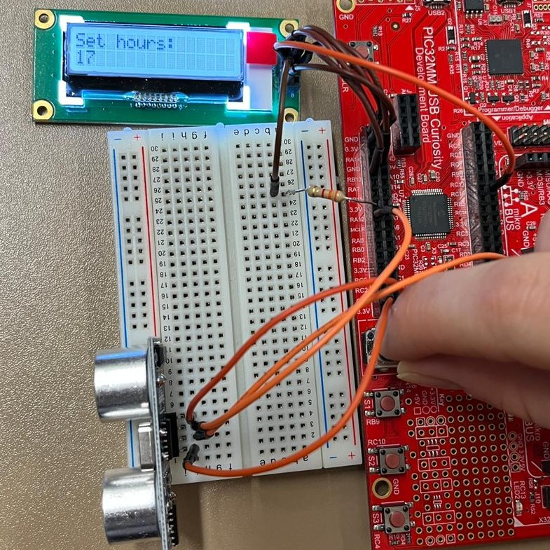
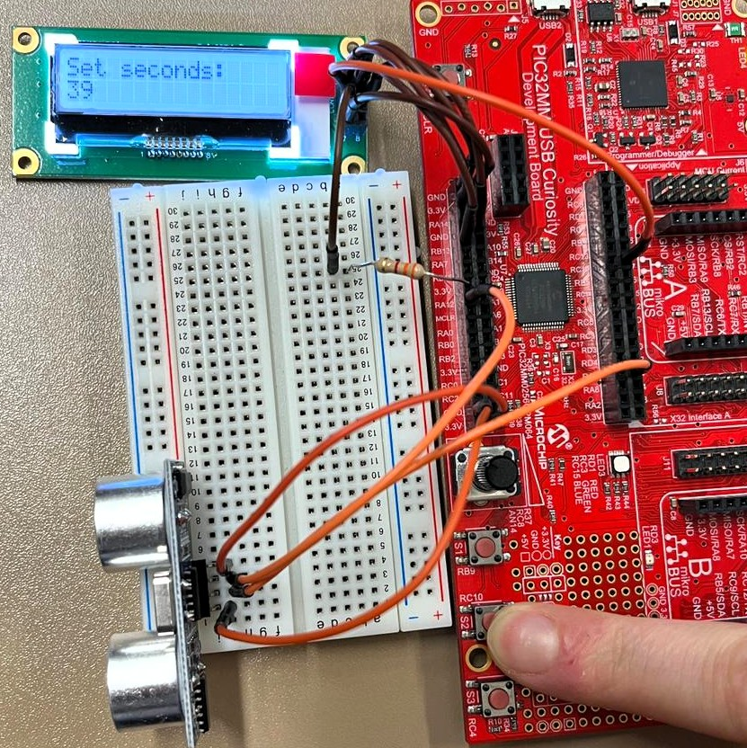
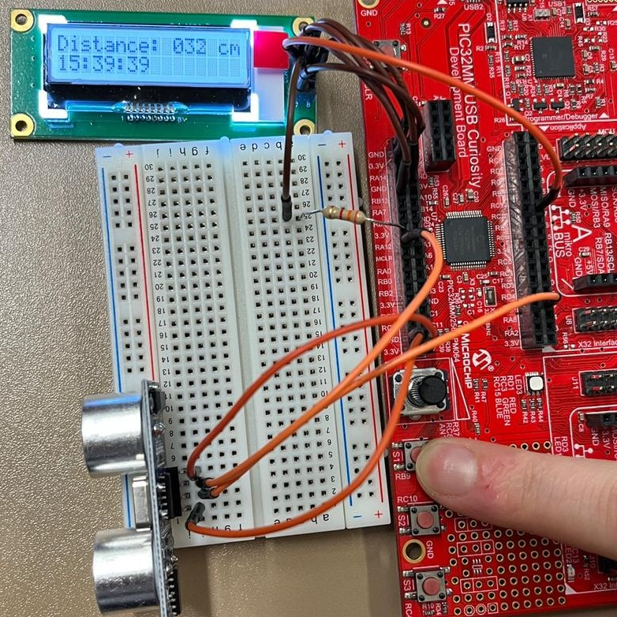

# Rechnerarchitekturen Labor

Lea Soffel (4962704) und Lukas Benner (3277496)

## Aufbau

Der Aufbau besteht aus: 

- PIC32MM0256GPM064 uC

- LCD - Display

- HC-SR04 Ultraschall Sensor

Das LCD ist folgendermaßen angeschlossen:

| Pin # | Funktion        | PIC32 Belegung      |
| ----- | --------------- | ------------------- |
| 1     | VDD             | 3.3V                |
| 2     | VSS             | GND                 |
| 3     | SDA             | RB7 (SDA3)          |
| 4     | SCL             | RB13 (SCL3)         |
| 5     | RST             | 3.3V über R=3.3kOhm |
| 6     | A (Backlight +) | 3.3V                |
| 7     | K (Backlight -) | GND                 |

Der Ultraschall Sensor ist wie folgt angeschlossen:

| Funktion | PIC32 Belegung    |
| -------- | ----------------- |
| VCC      | 5V                |
| Trig     | RA12 (OCM1A)      |
| Echo     | RA9 (5V tolerant) |
| GND      | GND               |

## Programmierung

### Implementierte Funktionalitäten

- Auslesen des Ultraschall Sensors
  
  - Trigger Signal durch **Output Compare Unit**
    
    - Mode: Dual Edge Compare
    
    - Trigger Signal: 10us
    
    - Zeit, die Ultraschall Sensor wartet: 8 * 1/40kHz 
    
    - Antwortzeit von Ultraschall Sensor: 38ms
    
    - Zeit für eine Periode: t = 10us + 8 * 1/40kHz + 38ms = 38.21 ms 
    
      
    
    - Periode: PR = 0xFFFF weil 0xFFFF × 16/24MHz = 43.69 ms, so hat man 43.69 ms - 38.21 ms = 5.48ms Puffer für andere Operationen
    
    - Steigende Flanke: RA = 0
    
    - Fallende Flanke: RB = 0xF weil 0xF × 16/24MHz = 10 μs
  
  - - Das Signal konnte nicht über einen Gated Timer ausgewertet werden weil die TxCK Pins nicht für 5V geeignet sind.
    
    - Bei steigender Flanke an RA9 wird das Timer Register auf 0 gesetzt
    
    - Bei fallendende Flanke an RA9 wird das Timer Register ausgelesen
    
    - Konvertierung der Timerintervalle zu μs:
      
      $time = interval*16/24MHz =    interval * 666 / 1000
      $
    
    - Halbierung der Zeit um die Zeit für eine Strecke zu bekommen
    
    - Konvertierung der Zeit in μs zu einer Distanz in cm:
      
      $distance = time * 0.034 32 cm∕μs = time * 3432 / 100000$

- Ausgabe auf dem LCD
  
  - Speichern der Distanz in einem String und ausgeben

- Ausschluss fehlerhafter Messungen und Mittelwert
  
  - Für die maximale Distanz beträgt die Pulsweite 25ms
  
  - Die daraus resultierende Distanz ist ungefähr 430 cm
  
  - Alle Werte über 450 cm können also ignoriert werden
  
  - Es wird der Mittelwert aus 2 gültigen Werten des Ultraschall Sensors gebildet

- Anzeigen der Uhrzeit in der zweiten Zeile des LCDs
  
  - Die Register der RTCC werden mit dem Wert des Präprozessor Makros `__TIME__` initialisiert.
  
  - Die aktuelle Zeit wird bei jedem Durchlauf der while(1) Schleife abgefragt, in einen String umgewandelt und auf dem LCD ausgegeben.

### Zusatzfunktionen

- Input Capture Unit für Rückgabewert des Ultraschall Sensor
- Output Compare für Impulse des Trigger Eingangs am Ultraschall Sensor
- Werte über 420 werden ausgeschlossen, Mittelwert wird immer über die letzten 4 Werte gebildet (Ring Buffer)
- Anzeigen der Zeit (Initialisiert mit Compile-Zeit)
- Anzeigen der Entfernung mit einem Balken (nah -> Balken "voll")
- Individuelles Setzen der Zeit über Taster
- Verwendung von Interrupts

### Bedienung

Nach dem Runterladen des Programs sollte auf dem Display die Distanz in cm und der Balken zu sehen sein:

Drückt man jetzt auf den Button S3, wird im Display statt dem Balken die aktuelle Zeit angezeigt:

## Änderung der Zeit

Drückt man auf den Button S1 kann eine eigene Zeit konfiguriert werden:

Mithilfe des Potentiometers kann eine beliebige Zahl eingestellt werden:

Drückt man auf S2 wechselt man zur Konfiguration der Minuten, mit dem Potentiometer kann dann wieder die Minutenzahl eingestellt werden:

Drückt man erneut auf S2 wechselt man zur Konfiguration der Sekunden, mit dem Potentiometer kann die Sekundenzahl eingestellt werden:

Die Zeit wird automatisch geändert sobald die Zahlen geändert wurden.

Drückt man auf S1 wird das Konfigurationsmenu verlassen und die neue Zeit übernommen:

Die aktuelle Zeit ist dann überschrieben, man kann nur per "Reset" wieder zurück zur Compile Zeit, allerdings ist diese ja nicht mehr korrekt.